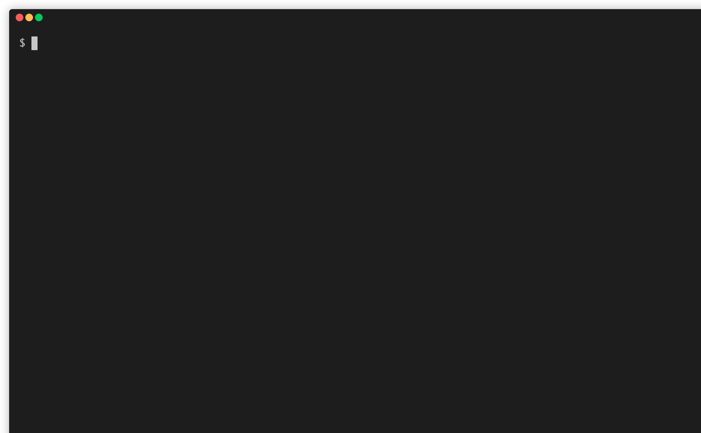

# idapm

`idapm` is IDA Plugin Manager. It works perfectly on macOS, it probably works on Windows and Linux. 
This is because I only have the macOS version of IDA Pro.



## Motivation

Managing the IDA Plugin is inconvenient. There is no official package manager and you have to copy files to the plugin directory manually. 
So I developed a plugin manager inspired by `go get` that allows you to install plugins from GitHub repositories without API server, and also allows you to import plugins from different directories on your PC with a single command.

## Installation

```
$ pip install git+ssh://git@github.com/tkmru/idapm.git
```

## Usage

### init

`init` command creates `~/idapm.json`. 
It contains information about the plugins you have installed.

```
$ idapm init
~/idapm.json was created successfully!
```

If `~/idapm.json` already exists, you can install the plugins listed in `~/idapm.json`.

```
$ idapm init
~/idapm.json already exists...
Do you want to install a plugin written in ~/idapm.json? [Y/n]: y
----------------------
Try: git clone https://github.com/L4ys/LazyIDA.git
Cloning into '/Applications/IDA Pro 7.5/ida.app/Contents/MacOS/plugins/idapm/L4ys/LazyIDA'...
Symbolic link(/Applications/IDA Pro 7.5/ida.app/Contents/MacOS/plugins/LazyIDA.py) has been created
Installed successfully!
```

### install

`install` command install plugin from GitHub repository or local.

#### from GitHub

You can install from the specified GitHub repository.

```
$ idapm install L4ys/LazyIDA
----------------------
Try: git clone https://github.com/L4ys/LazyIDA.git
Cloning into '/Applications/IDA Pro 7.5/ida.app/Contents/MacOS/plugins/idapm/L4ys/LazyIDA'...
Symbolic link(/Applications/IDA Pro 7.5/ida.app/Contents/MacOS/plugins/LazyIDA.py) has been created.
Installed successfully!
```

The installed plug-ins are marked in the config.

```
$ cat /Users/tkmru/idapm.json
{
  "plugins": [
    "keystone-engine/keypatch",
    "L4ys/LazyIDA"
  ]
}
```

#### from local

You can copy a Python script from the specified directory.

```
$ idapm install --local ./
Copy to /Applications/IDA Pro 7.5/ida.app/Contents/MacOS/plugins/test.py from ./test.py
Installed successfully!
```

### list

`list` command displays a list of installed plugins.

```
$ idapm list
List of scripts in IDA plugin directory
LazyIDA.py

List of plugins in config
L4ys/LazyIDA
```

### check

```
$ idapm check
IDA plugin dir:    /Applications/IDA Pro 7.5/ida.app/Contents/MacOS/plugins
idapm config path: /Users/tkmru/idapm.json
```

## License

GPLv3 - GNU General Public License, version 3

Copyright (C) 2020 tkmru
